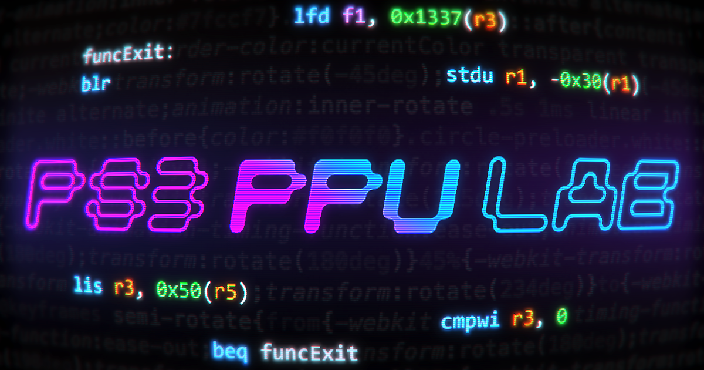

<div align="center">



# PS3 PPU Lab

A browser-based PowerPC assembler, editor, and disassembler for PS3 PPU code.

[**ppulab.dev**](https://ppulab.dev) · [Docs](https://ppulab.dev/docs)

</div>

---

## What it is

[CodeWizardPS3](https://github.com/Dnawrkshp/CodeWizardPS3) was the original PS3 PPU PowerPC assembler. It's over a decade old and it's how a lot of us first learned to write and patch Cell code. PS3 PPU Lab does the same job in the browser: write PowerPC, assemble it, and export it in whatever shape your tool wants.

It runs at [ppulab.dev](https://ppulab.dev), or you can run it yourself.

## Features

- Assembler and disassembler for the PS3 PPU (Cell) instruction set, AltiVec included. The encodings are verified against the ProDG SDK.
- Editor with syntax highlighting, find and replace, multi-cursor, and inline error checking.
- Structs, functions, globals, and imports that span multiple files.
- Control-flow and call graphs for any function.
- Output as hex, raw bytes, C# / C arrays, RPCS3 `patch.yml`, or NetCheat.
- A public HTTP API so you can assemble and disassemble from a script.

## Running locally

```bash
npm install
npm run dev
```

Open http://localhost:3000. Run the tests with `npm test`.

## API

The same assembler and disassembler are available over HTTP.

```bash
curl -X POST https://ppulab.dev/api/assemble \
  -H "content-type: application/json" \
  -d '{"asm": "li r3, 0x1\nblr"}'
```

The [docs](https://ppulab.dev/docs) cover the disassemble endpoint and the response shape.

## Built with

Next.js, React, CodeMirror, and React Flow.

## Credits

Built by [Mack Core](https://mackcore.io). Thanks to Dan for [CodeWizardPS3](https://github.com/Dnawrkshp/CodeWizardPS3), the original this grew out of.

## License

MIT. See [LICENSE](LICENSE).
